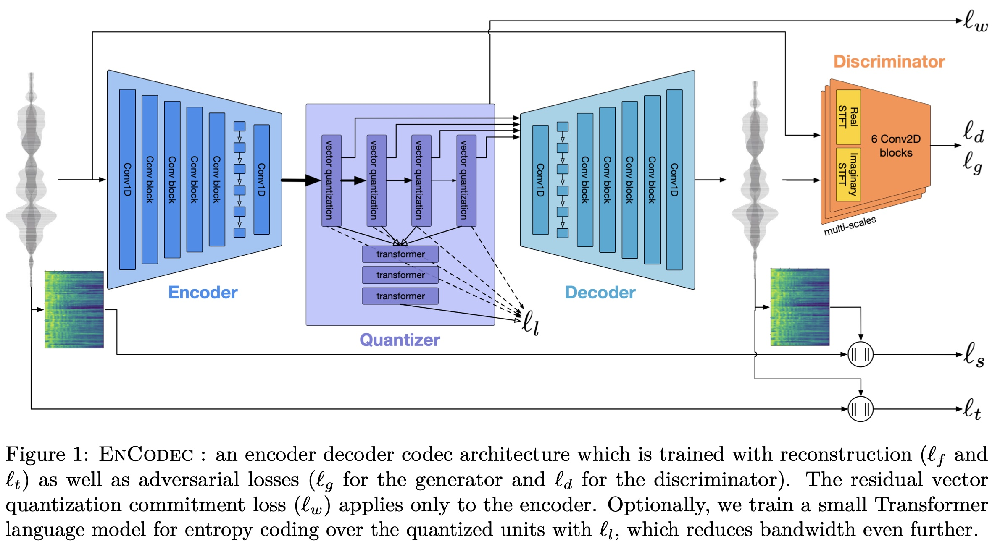
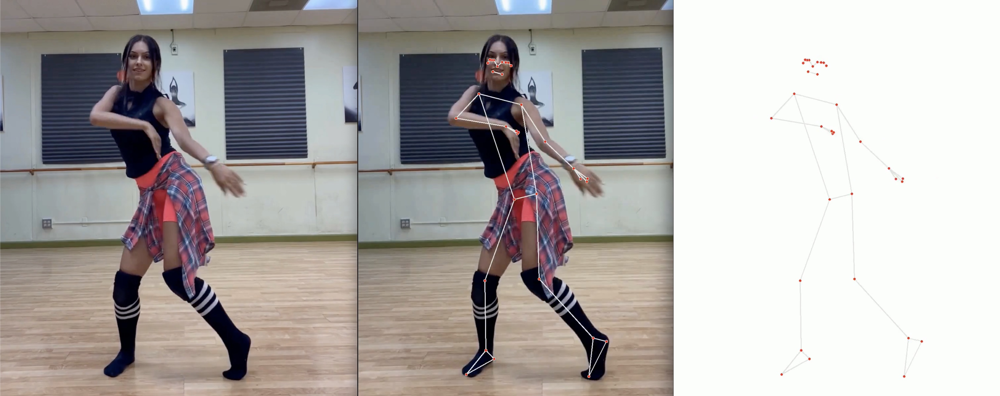
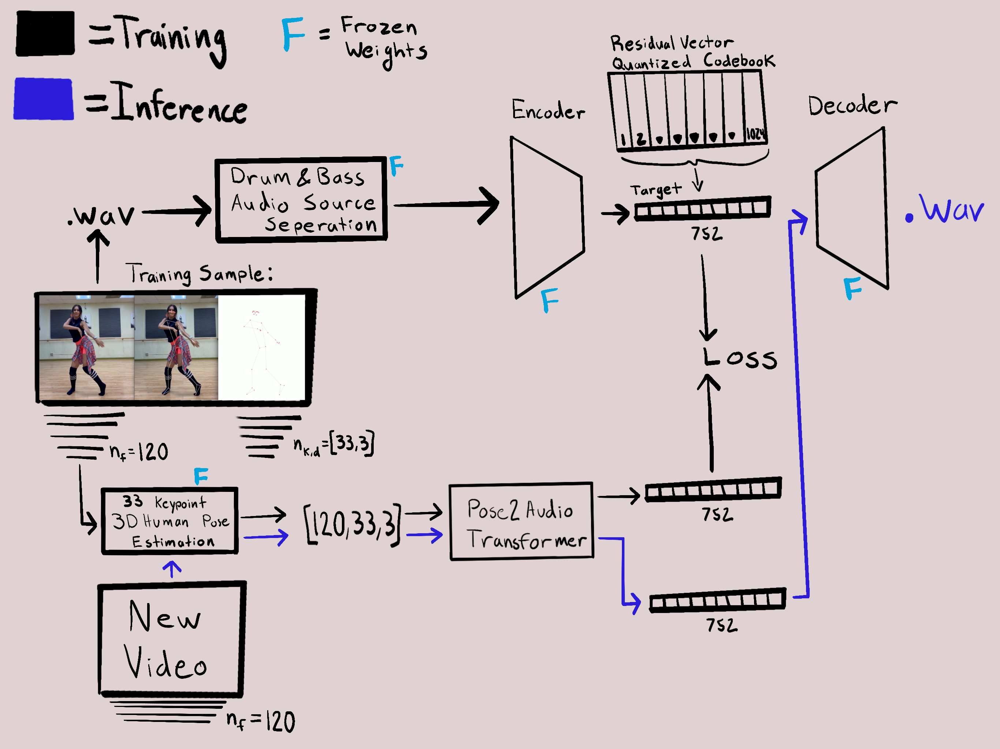

# Dance to Music

## Introduction
Welcome to DanceToMusic, a project that blends my interest in computer vison, audio signal processing and generative AI to create novel music based on a sequence of human poses. In its current state, this model takes in a 5 sec video, and returns a 5 second piece of generated audio that corresponds with the movement’s of the dancer in the video. 

## Motivation
Inspired by the recent 'text-to-image' (DALL-E, Midjourney, Stable Diffusion) and 'text-to-music' models (MusicLM, MusicGen), this project aims to develop 'Dance-to-Music'. Dance to Music is a technology that could have applicability in the world of social media or content creation, by allowing users to add custom music to their dance videos. Currently this model generates music based off the movements of a single subject in the video, however I can see it being easily extended to generate music conditioned on the movement of multiple subjects in a video. Now imagine if one were to install a camera inside a nightclub, and instead of there being a DJ, trust DanceToMusic to generate music in real-time, that is corresponding the movements of everyone in the club, what would that sound like?

## Table of Contents
- [Introduction](#introduction)
- [Motivation](#motivation)
- [Features](#features)
- [Technologies Used](#technologies-used)
- [Installation](#installation)
- [Usage](#usage)
- [EnCodec Model](#encodec-model)
- [Dataset](#dataset)
- [Model Architecture](#model-architecture)
- [Training](#training)
- [Next Steps](#next-steps)
- [Results](#results)
- [Credits](#credits)
- [License](#license)


## Features
- Video input analysis for human pose estimation.
- Generation of music through a sequence-to-sequence transformer model.
- Novel audio generation from predicted latent space representations.

## Technologies Used
- [MediaPipe](https://developers.google.com/mediapipe/solutions/vision/pose_landmarker) for 3D human pose estimation
- [Meta's EnCodec model](https://huggingface.co/docs/transformers/main/model_doc/encodec#transformers.EncodecModel) used to create audio encodings from .wav files, as well as a decoder that reconstructs audio from the encoded representation
- [Spleeter](https://github.com/deezer/spleeter) Used to isolate the drum and bass elemnts of the audio in the training set
- Python, PyTorch

## Installation
One can start playing with this project by first cloning the repository, building the dataset, and then running the training script. 
```bash

# Clone the repository
git clone https://github.com/azeezabdikarim/DanceToMusicApp.git

# Navigate to the repository
cd DanceToMusic

# It is recommended to create a Conda environment for the project to avoid
# conflicts with other packages and versions
conda create --name dance2music python=3.x

# Activate the Conda environment
conda activate dance2music

# Install the required packages
conda install --file requirements.txt

# If there are any packages not available via conda, install them using pip
pip install -r requirements.txt

# Build the video dataset, extracting 5 second clips at 24fps
python ml/data/building_tools/build_dnb_dataset.py --output_path ml/data/samples/ --input_csv ml/data/youtube_links/youtube_links_test.csv  --max_seq_len 5 --fps 24

# Install Flask for the web application
conda install flask

# Navigate to the webapp directory and run the Flask app
cd webapp/
python app.py


```
## Usage

## EnCodec Model
The EnCodec model is a state-of-the-art high fidelity audio encoder developed by the FAIR team at Meta. The model follows an encoder-decoder type of architecture with the latent space represented by a residual vector quantized latent space. The model is trained with perceptual loss where the generated samples were judged by a discriminator, to reduce artifacts and generate high quality samples. 

Adding a vector quantized codebook to an autoencoder architecture, such as the EnCodec model, enables a discrete representation of the latent space, which can be advantageous for handling complex data distributions and improving the robustness of the model against small input variations. This discretization also facilitates the learning of a more meaningful and structured latent space, which can be beneficial for downstream tasks like generation or retrieval.

When the codebook is extended to a Residual Vector Quantized (RVQ) Codebook, the model gains the ability to capture finer details by representing residuals or differences between the input and the current reconstruction at each stage. This layered approach of quantization allows the model to iteratively refine its output, leading to a more precise and higher fidelity reconstruction than what could be achieved with a standard Vector Quantized Codebook.

<!--  -->
<figure style="text-align: center;">
    
</figure>

## Dataset
The dataset used in this projects is a personally aggregated set of dance videos paired with their corresponding music. Each dance clip is processed using MediaPipe's 3D human pose estimation model. Only one human is selected per video clip, for which the model generates a set of 33x3 key points per frame. Videos are standardized in the training set to last 5 sec at 24fps, resulting in a sequence of 120 frames per sample. The final dimensions for an individual sample are therefore 120x33x3. 



For each dancing clip, I extracted the audio as a .wav file. Spleeter, and audio source seperation tool made by Deezer is used to extract the drum and base from each song, which are then combined to create a Drum and Bass version of each track. I use the '24khz' encoder of the EnCodec audio encoder, to the map the 5 second drum and base audio clip to a lower dimensionality latent space. For a 5 second clip, the EnCodec model produces a latent vector of 2x377, which is then flattened to 1x754, and use as the target in the training dataset.

## Model Architecture 

*Note: This image illustrates the model architecture prior to the WGAN updates.*

The core objective of this project is to produce a sequence-to-sequence model capable of mapping a sequence of 33x3 human pose key points to a latent vector, which represents a sequence of codebook values. One of the advantages of using the audio codes generated by the EnCodec model for our target is the fact that the latent space is represented by a sequence of discrete values from a codebook, meaning the model only needs to learn to predict values of a fixed vocabulary. In the case of the '24khz' EnCodec model, the length of the codebook is 1024. In comparison to the text based tasks where the vocabulary can be thousands of distinct values, 1024 values is a relatively small vocabulary, which increases the chances for success.

In the context of our training dataset of 5 sec clips filmed at 24fps with an audio sample rate of 24khz, our goals is to map a vector sequence of 120x33x3 to a latent audio code sequence of 1x754. Due to the layered approach of quantization in a RVQ codebook, our sequence-to-sequence model most reconstruct the audio codes autoregressively. 

### Transition to WGAN Framework
Initially, the model employed a standard sequence-to-sequence transformer, focusing primarily on generating audio codes using NLLLoss (Negative Log Likelihood Loss). The recent integration of the Wasserstein Generative Adversarial Network (WGAN) framework marks a significant evolution in the model's architecture. This update enhances the model's ability to produce more realistic geneerate audio. The details of this architecutral change are desrcribed below in the 'Training' section of this document. 

## Training

### Overview
The PoseToMusic Transformer employs the Wasserstein Generative Adversarial Network (WGAN) framework to generate music from human pose sequences. This process involves two key components: the Generator and the Discriminator.

### Training Data
- **Dataset Composition**: Approximately 2000 training and 350 validation samples.
- **Split Ratio**: 85% training, 15% validation.

### The Generator
The generator, structured as an encoder-decoder, serves as the core of the PoseToMusic model.

#### Encoder
- **Task**: Encode a sequence of human pose estimates.
- **Output**: Contextual information for the decoder.

#### Decoder
- **Function**: Autoregressively predicts sequences of codebook values.
- **Target**: Matches EnCodec's encoding of the audio file.
- **Process**: Utilizes softmax vectors for discrete codebook values, treated as class labels.
- **Teacher Forcing**: Applied 50% of the time to accelerate convergence.

#### Generator Training Loss Components
- **NLLLoss**: Measures the Negative Log Likelihood between generated and target audio codes.
- **Perceptual Loss**: Uses the MSE between the Mel-Spectra of generated and target audio samples.
- **Adversarial Loss**: Based on the discriminator's evaluation of the generated output.

### The Discriminator (Critic)
- **Structure**: Simple feed-forward neural network with three hidden layers.
- **Input**: Flattened audio code tensor.
- **Output**: Single neuron without sigmoid activation.

### Wasserstein Loss and Training Process
- **Discriminator as Critic**: Unlike traditional GANs, the discriminator in WGAN acts as a critic rather than a classifier. It assesses the quality of generated samples using the Earth Mover's Distance (EMD), also known as Wasserstein distance.
- **Wasserstein Distance Calculation**: This distance measures the cost of transporting mass to transform the distribution of the generated data into the distribution of real data, providing a smoother and more stable training process.
- **Training Updates**:
  - **Discriminator weights**: Updated every training batch.
  - **Generator weights**: Updated every four batches.
- **Loss Calculation**: Incorporates the Wasserstein distance for the discriminator and a combination of NLLLoss, perceptual loss, and adversarial loss for the generator.

### Training Termination
- **Criterion**: Cease training when validation loss plateaus, avoiding overfitting.


## Results
Sample results can be viewed below by clicking on the thumbnails. In the models current state we can see that the results are not yet ideal. The audio generated has the hints of musicality, however it doesn't come close to obviously matching the movement of the dancer.

<table>
  <tr>
    <td>
      <a href="https://youtu.be/LlN2wxKExRo" target="_blank">
        
      </a>
      <p align="center">Ground Truth</p>
    </td>
    <td>
      <a href="https://youtu.be/3oJERPxoX34" target="_blank">
        
      </a>
      <p align="center">Prediction</p>
    </td>
  </tr>
</table>


## Next Steps
I have a few theories for why the model struggles to produce suitable music to match the subjects movements. To improve the generative abilities I am looking into:
- experimenting the values used to weight the generator's loss
- training the models longer (currently the max training run was 6 epochs ~8 hours on a NVIDIA GeForce RTX 3080)
- exapnd/clean the training dataset

#### Improve the Training Data
- Currently there are roughly 1,300 5sec training samples. I am working to increase the size of the training set to 10,000+ samples. 
- The human pose estimation isn't perfect. In some samples, there are momentary glitches in the keypoint detection, which may be having more impact than is trully understood. Manualy cleaning fo this dataset would be tedious, so I am looking into strategies of automatically identifying samples where the pose estimation performs poorly. 

## Credits

EnCodec
```
@article{defossez2022highfi,
  title={High Fidelity Neural Audio Compression},
  author={Défossez, Alexandre and Copet, Jade and Synnaeve, Gabriel and Adi, Yossi},
  journal={arXiv preprint arXiv:2210.13438},
  year={2022}
}
```
Spleeter 
```
@article{spleeter2020,
  doi = {10.21105/joss.02154},
  url = {https://doi.org/10.21105/joss.02154},
  year = {2020},
  publisher = {The Open Journal},
  volume = {5},
  number = {50},
  pages = {2154},
  author = {Romain Hennequin and Anis Khlif and Felix Voituret and Manuel Moussallam},
  title = {Spleeter: a fast and efficient music source separation tool with pre-trained models},
  journal = {Journal of Open Source Software},
  note = {Deezer Research}
}
```

## License
